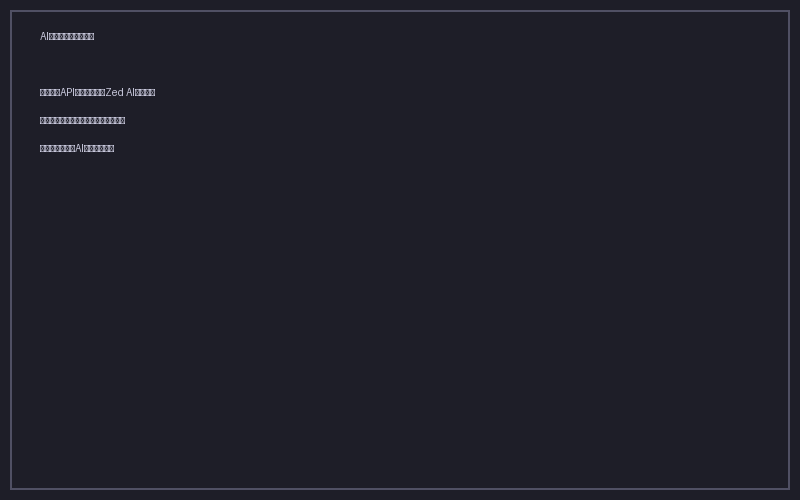

# AI アシスタント（Zed AI 連携）

本ツールはローカル HTTP API サーバを起動し、Zed エディタの AI 機能と連携してブックマークの管理を支援します。

## 事前準備

1. **Zed エディタ** がインストールされていること
2. Zed の AI 機能が有効化されていること（設定 → AI）

## 使い方

### 1. API サーバを起動

アプリを起動すると、自動的にローカル HTTP サーバが `http://localhost:9876` で起動します。

### 2. AI アシスタントパネルを開く

ヘッダーの **AI** ボタンをクリックすると、AI アシスタントパネルが表示されます。

### 3. プロンプトをコピー

パネル内のプロンプトテンプレート（Copy ボタン）をクリックして、Zed に貼り付けられる形式でコピーします。

以下のテンプレートが用意されています。

| テンプレート | 用途 |
|---|---|
| タグ付け | 未分類ブックマークに AI がタグを提案 |
| タイトル整形 | 抽出された URL タイトルをクリーンアップ |
| AI マージ | 重複ブックマークのマージ判断 |
| 分析 | ブックマークコレクションの分析レポート |

### 4. Zed で実行

1. Zed を開き、AI チャットを起動（`Cmd + I`）
2. コピーしたプロンプトを貼り付け
3. AI が API を呼び出し、結果を JSON で返します
4. パネル内の **適用** ボタンで結果をブックマークに反映

### API エンドポイント

Zed AI からアクセス可能なエンドポイント:

| エンドポイント | メソッド | 説明 |
|---|---|---|
| `/api/bookmarks/untagged` | GET | 未分類ブックマーク一覧 |
| `/api/bookmarks/:id` | GET | 単一ブックマークの詳細 |
| `/api/bookmarks/:id` | PATCH | ブックマークの更新（タグ・タイトル等） |
| `/api/tags` | GET | 全タグ一覧 |
| `/api/duplicates` | GET | 重複グループ一覧 |
| `/api/health` | GET | ヘルスチェック |
