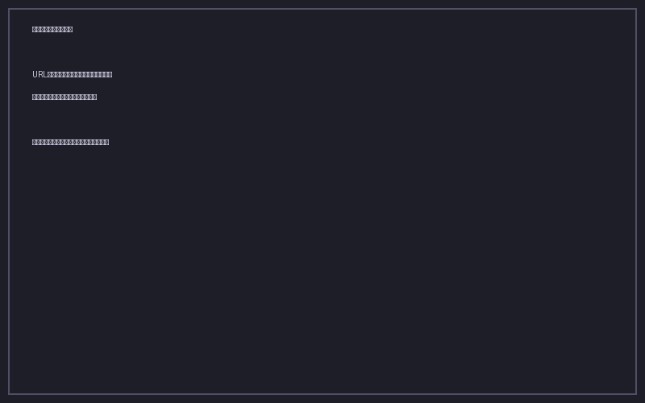

# 重複検出・マージ

ブックマークが増えてくると、同じ URL を複数回保存してしまうことがあります。本ツールは URL を正規化して重複を検出し、統合（マージ）できます。

## 重複スキャン

1. ヘッダーの **重複** ボタンをクリック
2. 重複グループが一覧表示されます
3. 各グループでチェックボックスをオンにして、まとめてマージ / スキップを選択



## URL 正規化

以下のパラメータを除去してから比較するため、実質的に同じページであれば確実に検出できます。

- `utm_source`, `utm_medium`, `utm_campaign`, `utm_term`, `utm_content`
- `fbclid`, `gclid`, `ref`, `source`

例:
```
https://example.com/page?utm_source=twitter&id=123
https://example.com/page?id=123
```
→ 両方とも `https://example.com/page?id=123` として扱われ、重複と判定されます。

## マージ内容

マージを実行すると、次のルールで統合されます。

| 項目 | マージルール |
|---|---|
| タイトル | 最も長い空でないタイトルを採用 |
| タグ | すべてのタグの和集合 |
| 訪問回数 | 合計値 |
| メモ | 改行で連結 |
| ソース | 残す方を指定、片方は論理削除 |

マージが完了すると、元の重複グループは自動的に閉じられます。
