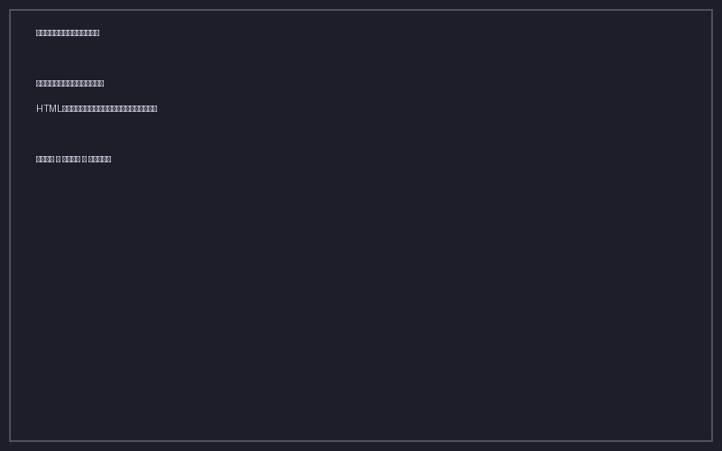

# ブックマークのインポート

## 概要

各ブラウザのエクスポート機能で HTML ファイルを生成し、それを本ツールに取り込みます。

## 各ブラウザのエクスポート手順

### Google Chrome

1. メニュー → ブックマーク → ブックマークマネージャ（`Cmd + Option + B`）
2. 右上の `⋯` → ブックマークをエクスポート
3. `bookmarks.html` がダウンロードされます

### Mozilla Firefox

1. ライブラリ（`Cmd + Shift + O`）→ インポートとバックアップ → HTML 形式でエクスポート
2. `bookmarks.html` がダウンロードされます

### Safari

1. ファイル → ブックマークを書き出す
2. `Safari Bookmarks.html` がダウンロードされます

### Microsoft Edge

Chrome と同様の Chromium ベースです。

1. メニュー → お気に入り → お気に入りの管理 → `⋯` → お気に入りをエクスポート
2. `bookmarks.html` がダウンロードされます

## インポート実行

1. アプリのメニューから **ファイル → インポート** を選択
2. 先ほどエクスポートした HTML ファイルを選択
3. インポートが完了すると、ブックマーク一覧が更新されます

## 注意点

- 同じ URL のブックマークが既に存在する場合は、重複検出機能で確認できます（重複タブを参照）
- 複数のブラウザから順番にインポートすることで、すべてのブックマークを一元管理できます
- HTML ファイル内のフォルダ構造はタグとしてインポートされます
