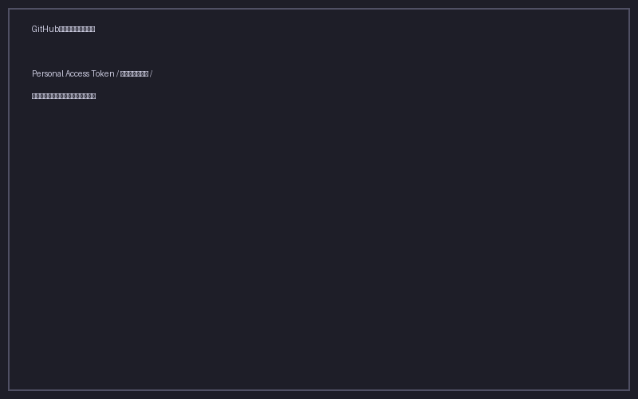
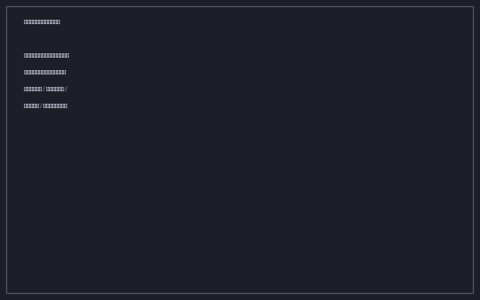

# GitHub 同期

GitHub リポジトリを介して、複数のデバイス間でブックマークを同期できます。各デバイスごとに個別の JSON ファイルが保存され、デバイス間の差分はコンフリクト解決 UI で安全にマージできます。

## セットアップ

### 1. GitHub Personal Access Token の発行

1. GitHub にログイン → Settings → Developer settings → Personal access tokens → Tokens (classic)
2. **Generate new token (classic)** をクリック
3. スコープで **`repo`** にチェック（フルコントロール）
4. 任意のメモ（例: "Bookmark Manager PE"）を入力
5. 生成されたトークンをコピー（`ghp_xxxxx`）

![トークン発行画面（GitHub）]

### 2. 同期リポジトリの準備

同期用の GitHub リポジトリを新規作成してください（公開・非公開どちらでも可）。リポジトリの中身は自動的に管理されます。

### 3. アプリで設定

1. サイドバー下部の **同期** ボタンをクリック
2. 表示されたダイアログに以下の項目を入力:
   - **Personal Access Token**: 先ほど発行したトークン
   - **リポジトリ所有者**: ユーザー名または Organization 名
   - **リポジトリ名**: 作成したリポジトリ名
   - **デバイス名**: このデバイスの識別名（例: "MacBook Air"）



3. **接続テスト＆保存** をクリック
4. 接続成功すると、サイドバーにグリーンのクラウドアイコンが表示されます

## 同期の実行

サイドバーの **同期** ボタンをクリックすると、以下の流れで同期が実行されます。

1. GitHub から他デバイスのブックマークファイルを取得
2. ローカルのブックマークとマージ
3. 自分のデバイスのブックマークを GitHub にプッシュ
4. 結果を通知（何件取り込んだか、何件送信したか）

## コンフリクト解決

同じブックマークが複数のデバイスで別々に更新されていた場合、コンフリクト解決モーダルが表示されます。



各コンフリクトごとに以下の選択肢があります。

| 選択肢 | 動作 |
|---|---|
| ローカルを保持 | このデバイスの内容を残す |
| リモートを採用 | GitHub 上の内容で上書き |
| 自動マージ | タイトル・タグ・メモを統合 |
| スキップ | 今回は判断せず、後で再度同期 |

すべてのコンフリクトを解決したら **完了** をクリックします。

## データの保存形式

リポジトリ内のファイル構造:

```
リポジトリ/
├── bookmarks/
│   ├── device-{id1}.json    # デバイス A のブックマーク
│   └── device-{id2}.json    # デバイス B のブックマーク
├── metadata/
│   ├── devices.json         # 登録デバイス一覧
│   └── sync-state.json      # 同期状態
```

各デバイスのデータは独立したファイルとして保存されるため、あるデバイスで障害が起きても他のデバイスに影響しません。
